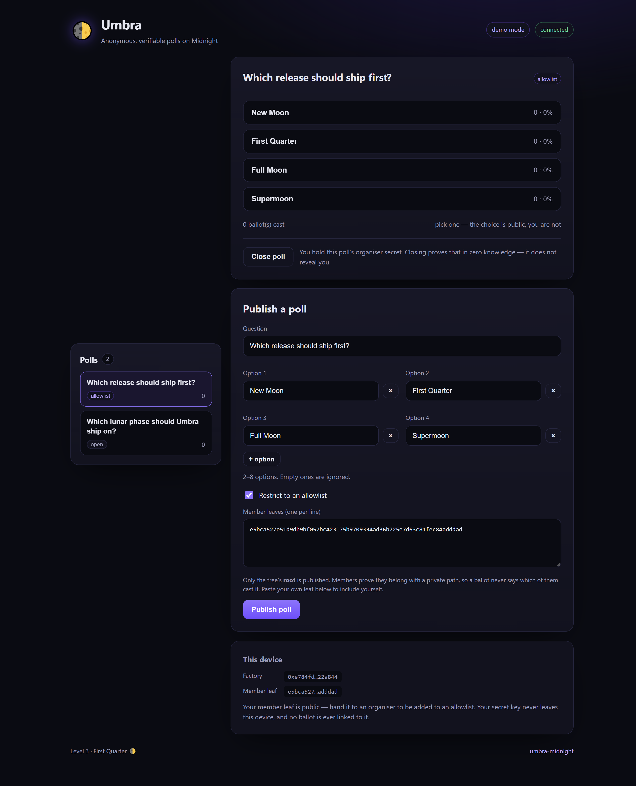
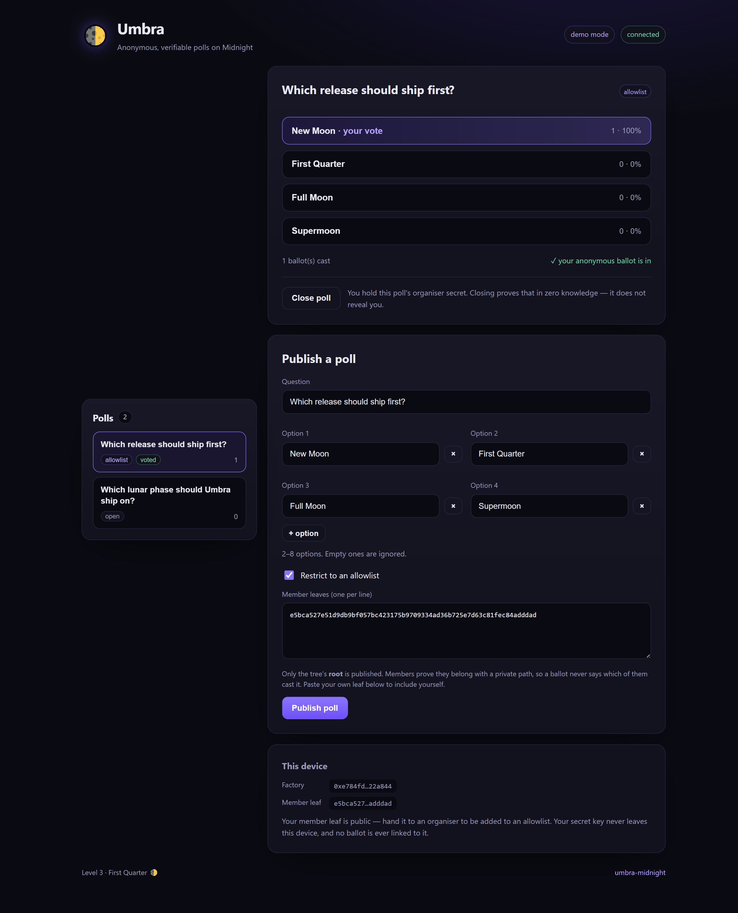
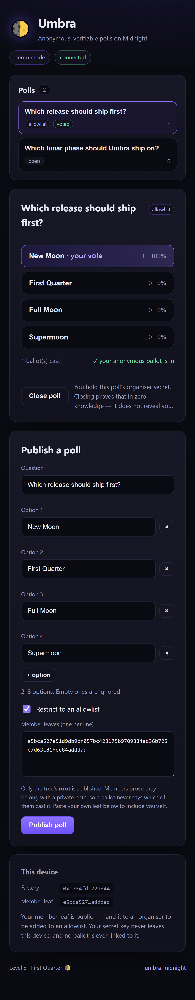
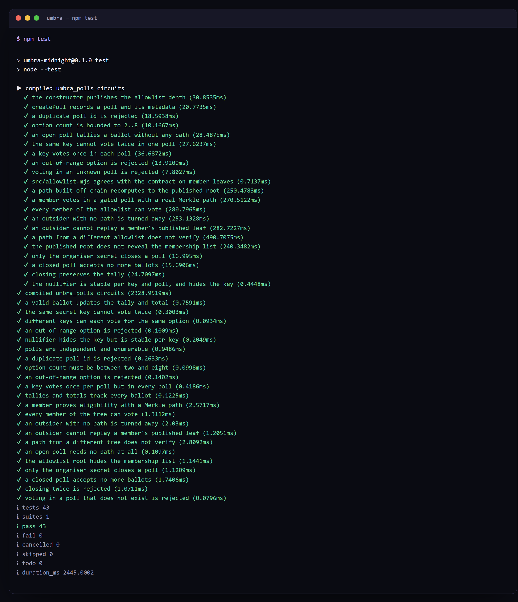
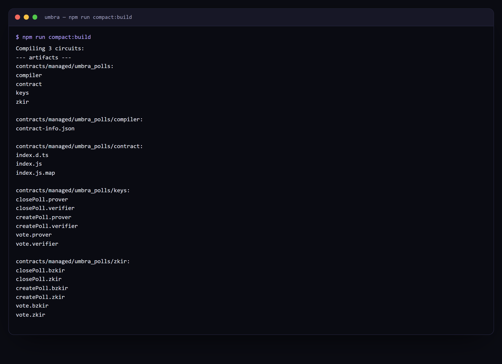

# 🌓 Umbra — anonymous, verifiable polls on Midnight

[](https://github.com/itsgriznft/umbra-midnight/actions/workflows/ci.yml)
[](https://itsgriznft.github.io/umbra-midnight/)
[](LICENSE)

> _Start in the dark. Ship in the light._
> Level 3 (First Quarter) submission for **New Moon to Full: Monthly Moonshots on Midnight**.

**▶ Live demo: <https://itsgriznft.github.io/umbra-midnight/>** — the full
connect → publish → vote → close flow, in the browser, no wallet required.

## The idea, in a paragraph

On transparent chains, on-chain governance publishes the complete voting history of every
address, which invites coercion and vote-buying and makes people copy the whales instead of
voting their own view. Moving the vote off-chain hides it but throws away verifiability — you
then have to trust whoever counts. **Umbra** is a poll factory where the tally is public and
auditable but the voter is not, and nobody can vote twice: a secret key that never leaves the
device derives a nullifier that the circuit checks and records, and polls can be gated by a
Merkle allowlist so a ballot proves the voter was eligible without revealing which member cast
it. The reusable primitive underneath — a nullifier-gated anonymous action with private
eligibility — is meant to outlive this one app.

Umbra is a privacy-first voting dApp built on [Midnight](https://midnight.network) with the
[Compact](https://docs.midnight.network) smart-contract language. It gives communities a poll
where **the result is public and auditable, but how any individual voted is not** — and where
**nobody can vote twice**, all enforced by zero-knowledge proofs.

## Screenshots

| | |
| --- | --- |
|  |  |
| Many polls in one contract — one gated by an allowlist, one open. The organiser card appears only for polls whose secret this device holds. | A ballot is in. The tally moved; nothing on screen or on chain links it to the voter. |

| Mobile | Tests |
| --- | --- |
|  |  |

Compiling both contracts to ZK circuits: 

## Privacy model — what an observer can and cannot learn

This is the claim the whole project rests on, so it is worth stating precisely. Assume an
observer who can read the entire ledger and every transaction.

**They can learn:**

- how many ballots each option received, and the total per poll — the tallies are plain
  counters in public state, which is the point;
- each poll's question, option count, whether it is gated, and its allowlist **root**;
- that every counted ballot came from a distinct key that was eligible for that poll;
- the set of spent nullifiers, and that a nullifier was added when a ballot was cast.

**They cannot learn:**

- which member cast which ballot — the ballot carries no identity, only an unlinkable tag;
- whether a particular member voted at all: a nullifier is `hash(domain, pollId, secretKey)`,
  and without the secret key it cannot be matched to a person;
- the membership list of a gated poll from the chain alone — only the root is published;
- the voter's position in the allowlist tree, because the Merkle path stays a private witness
  and never enters the transcript;
- anyone's secret key, which never leaves the device.

**What is deliberately public:** the chosen option. It has to be, to move a public counter. So
Umbra hides *who voted how*, not *how many chose what* — which is exactly the trade a public
tally requires.

**No trusted tallier.** Correctness is enforced by the circuit. There is no operator who could
miscount, and no admin key that can rewrite a tally.

## The problem

On transparent chains, on-chain governance leaks the full voting history of every address.
That enables **coercion, vote-buying, and herding** (people copy whales), and it deters honest
participation. "Just move it off-chain" throws away verifiability — you then have to trust the
tallier.

## What Umbra does

| Property | How |
| --- | --- |
| Public, auditable tally | Per-option counters live in the public ledger |
| Anonymous voter | The ballot never stores an identity; only an unlinkable nullifier |
| One vote per member | A nullifier derived from the voter's secret key is recorded once |
| No trusted tallier | Correctness is enforced by the ZK circuit, not an operator |

The voter's secret key is provided by a local `witness` and **never leaves the device**. The
circuit derives a deterministic nullifier from it, checks it hasn't been used, records it, and
increments the chosen option's public counter.

## Contracts

Two Compact contracts, both compiled and tested in CI:

| File | What it is |
| --- | --- |
| [`contracts/umbra.compact`](contracts/umbra.compact) | **Level 1.** One fixed poll, up to four options. The smallest honest version of the idea. |
| [`contracts/umbra_polls.compact`](contracts/umbra_polls.compact) | **Level 3.** A poll *factory*: many polls in one contract, each optionally gated by a Merkle allowlist. |

### The poll factory (Level 3)

`umbra_polls.compact` generalises the original in three ways.

**Many polls, one contract.** Polls live in a `Map<Bytes<32>, Poll>` and are created by anyone
with `createPoll`. Tallies are keyed by `tallyKey(pollId, option)`, so polls never collide.

**One ballot per voter per poll.** The nullifier is domain-separated by poll id, so a single
secret key votes in every poll — but only once in each:

```compact
export circuit voterNullifier(pollId: Bytes<32>, sk: Bytes<32>): Bytes<32> {
  return persistentHash<NullifierInput>(NullifierInput {
    domain: pad(32, "umbra:nullifier:v2"), pollId: pollId, secretKey: sk,
  });
}
```

**Private eligibility via a Merkle allowlist.** An organiser publishes only the *root* of a tree
of member leaves. A voter proves membership with a path supplied as a private witness — the
path never enters the transaction, so a ballot cannot be traced to a member:

```compact
witness allowlistPath(): MerkleTreePath<10, Bytes<32>>;

const path = allowlistPath();
const derivedRoot = merkleTreePathRoot<10, Bytes<32>>(path);
const ownLeaf = path.leaf == memberLeaf(sk);
const eligible = !poll.gated || (ownLeaf && derivedRoot == poll.allowRoot);
assert(disclose(eligible), "Umbra: not on this poll's allowlist");
```

The `ownLeaf` check is load-bearing. Member leaves are **public** — an organiser has to publish
them to build the tree — so a valid path is not a secret. Binding the path's leaf to the voter's
own key is what stops an outsider replaying someone else's leaf, and
[`test/circuit.test.mjs`](test/circuit.test.mjs) proves it against the real circuit.

A poll can also be closed by whoever knows the organiser secret behind its `closeAuth` digest,
proving that in zero knowledge rather than by revealing an address.

### The Level 1 contract

[`contracts/umbra.compact`](contracts/umbra.compact) — a single fixed poll with up to four
options. Highlights:

```compact
witness localSecretKey(): Bytes<32>;

export circuit vote(option: Uint<8>): [] {
  assert(option < optionCount, "Umbra: option out of range");
  const tag = disclose(voterNullifier(localSecretKey()));
  assert(!nullifiers.member(tag), "Umbra: this voter has already voted");
  nullifiers.insert(tag);
  // ...increment the chosen option's public counter + totalVotes
}
```

## Getting started

Requires Node.js ≥ 22 and the Compact toolchain (Linux/macOS, or Windows via WSL2).

```bash
# 1. Install the Compact developer tools, then the compiler
curl --proto '=https' --tlsv1.2 -LsSf \
  https://github.com/midnightntwrk/compact/releases/latest/download/compact-installer.sh | sh
compact update 0.31.0

# 2. Install JS deps
npm install

# 3. Compile the contract to zero-knowledge circuits
npm run compact:build      # -> contracts/managed/umbra/

# 4. Typecheck + run the reference-model tests
npm run typecheck
npm test
```

Compilation emits the JS/TS bindings and proving/verifying keys under
`contracts/managed/umbra/` (git-ignored). Deployment to the Preview/Preprod testnet with a
funded [Lace](https://www.lace.io) wallet is wired up in **Level 2** (see the
[roadmap](ROADMAP.md)).

## Project layout

```
contracts/umbra.compact       # Level 1: one fixed poll
contracts/umbra_polls.compact # Level 3: the poll factory + Merkle allowlist
src/allowlist.mjs             # builds the allowlist tree + the voter's witness path
src/witnesses.ts              # witness wiring — supplies the private secret key
src/contract.ts               # binds the compiled contract to its witnesses (for the UI)
src/types.ts                  # off-chain private-state + poll/result types
test/logic.test.mjs           # reference model of the Level 1 rules
test/polls.test.mjs           # reference model of the factory + allowlist rules
test/circuit.test.mjs         # runs the REAL compiled circuits against a local ledger
deploy/deploy.mjs             # headless deploy to Preprod
deploy/faucet.mjs             # funds a Preprod address via the faucet (see below)
ui/                           # React + Vite frontend — see ui/README.md
infra/                        # local proof server (WSL2 + Docker)
.github/workflows/ci.yml      # CI: typecheck, tests, compile contracts, circuit tests, build UI
IDEA.md                       # the product idea (Level 1 "seed the idea")
ROADMAP.md                    # how Umbra grows across the six lunar levels
```

## Tests

```bash
npm test                        # reference models (no toolchain needed)
npm run compact:build && npm test   # …plus the circuit-level tests
```

`test/circuit.test.mjs` is the one that matters most. It instantiates the **compiled** contract
against a local ledger and drives `createPoll` / `vote` / `closePoll` for real, which means:

- the allowlist tree built by `src/allowlist.mjs` is checked against `merkleTreePathRoot` as the
  circuit computes it — if the two ever diverged, every gated vote would fail on-chain;
- `memberLeaf` in JS is asserted equal to `pureCircuits.memberLeaf`;
- the leaf-replay attack is shown to be rejected *by the circuit*, not by a model of it.

It skips itself when `contracts/managed/` is absent, so `npm test` works on a bare checkout; CI
compiles first and always runs it.

## Frontend

A React + Vite app in [`ui/`](ui/) drives the factory through a single `UmbraFactory`
interface: browse polls, publish one (open or allowlisted), vote, and close it as organiser.
It ships with a **mock factory** that runs entirely in the browser with no wallet — it enforces
the same rules the contract does, including the leaf-binding check — so the whole flow is
demoable offline. The Level 2 single-poll seam (`UmbraController`, plus the Lace controller
that deploys and votes on **Preprod**) is still in `ui/src/umbra/`. Quick demo:

```bash
cd ui && npm install && npm run dev   # http://localhost:5173
```

See [ui/README.md](ui/README.md) to run it against a real Lace wallet on Preprod.

## Local infrastructure (Preprod)

Running on Preprod needs a local **Midnight proof server** (the indexer/node are
public and supplied by the wallet). [`infra/`](infra/) automates it inside an
isolated Ubuntu WSL2 distro + Docker:

```powershell
powershell -ExecutionPolicy Bypass -File infra/wsl-import.ps1        # create the distro
wsl -d MidnightUbuntu -u root -- bash /mnt/f/Milad/Midnight/umbra/infra/setup-proof-server.sh
```

Proof server → `http://127.0.0.1:6300`. Full guide (incl. Lace + faucet) in
[infra/INFRA.md](infra/INFRA.md). With Docker Desktop instead:
`docker compose -f infra/docker-compose.yml up -d`.

## Deploying to Preprod

```bash
cd deploy && npm install
node faucet.mjs <mn_addr_preprod1...>   # fund an address (needs a CDP-controlled Chrome)
npm run deploy                           # build a wallet, sync, deploy, print the address
```

**A trap worth knowing about.** `@midnight-ntwrk/testkit-js`'s `FaucetClient` POSTs to the
faucet URL *root* with a hardcoded dummy captcha header. Against the public Preprod faucet that
hits the single-page app, which answers `HTTP 200` with its HTML — so the client logs
`Faucet response: OK` and **no tokens are ever requested**. It is a silent no-op that looks
exactly like success, and it will leave you watching a wallet sync for hours waiting for money
that is not coming. The real API is `POST /api/request-tokens` with a genuine Cloudflare
Turnstile token, which is what [`deploy/faucet.mjs`](deploy/faucet.mjs) does by driving a real
browser over the DevTools Protocol.

Note that a fresh wallet must sync the whole chain before it can build a transaction, and the
dust wallet is the slow part — expect this to run for hours, not minutes. `deploy.mjs` logs
`applied/relevant` counters per sub-wallet so you can tell progress from a stall. (Completion
compares `appliedIndex` against `highestRelevantWalletIndex`, *not* the chain tip.)

### Current status: blocked upstream

The faucet funding works — the wallet below holds **1,000,000,000 NIGHT** on Preprod
(`mn_addr_preprod1hjhaql2xsgpdnckez80hlnseaj5k33jlalkw0tuphg394pt3yj5qwujsrm`, funded by tx
`002eea9377b5f903c9c449d4efedbf2a33e3192399145819d9873655260f2fd366`). The shielded and
unshielded wallets sync to completion. The **dust wallet does not**: partway through, the sync
stream starts failing to decode ledger events and never advances again —

```
Wallet.Sync: Transformation process failure
  └─ Failed to decode ledger event payload
     actual: { id: 1329323, protocolVersion: 1000000, … }
```

`@midnight-ntwrk/wallet-sdk-shielded@3.0.1` is the newest published version, and
`wallet-sdk@1.1.0` pins that same version, so this is not something a dependency bump fixes:
Preprod is emitting events the released SDK cannot parse. Without a synced dust wallet there is
no way to pay fees, so the headless deploy cannot produce a contract address until the SDK
catches up with the chain. Everything up to that point is automated and reproducible.

## Status

- ✅ **Level 1 — New Moon:** first Compact contract + toolchain + tests + CI, idea seeded.
- ✅ **Level 2 — Waxing Crescent:** React UI wired to the contract via `UmbraController`;
  mock controller fully working; Lace/Preprod controller code-complete and enabled with a
  local proof server + wallet (see [ui/README.md](ui/README.md)).
- ✅ **Level 3 — First Quarter:** the poll factory — many polls per contract, Merkle-allowlist
  eligibility proven in zero knowledge, organiser-authorised closing, a multi-poll UI, and a
  test suite that runs the real compiled circuits in CI.

See [ROADMAP.md](ROADMAP.md) for the full six-phase plan.

## License

[MIT](LICENSE).
